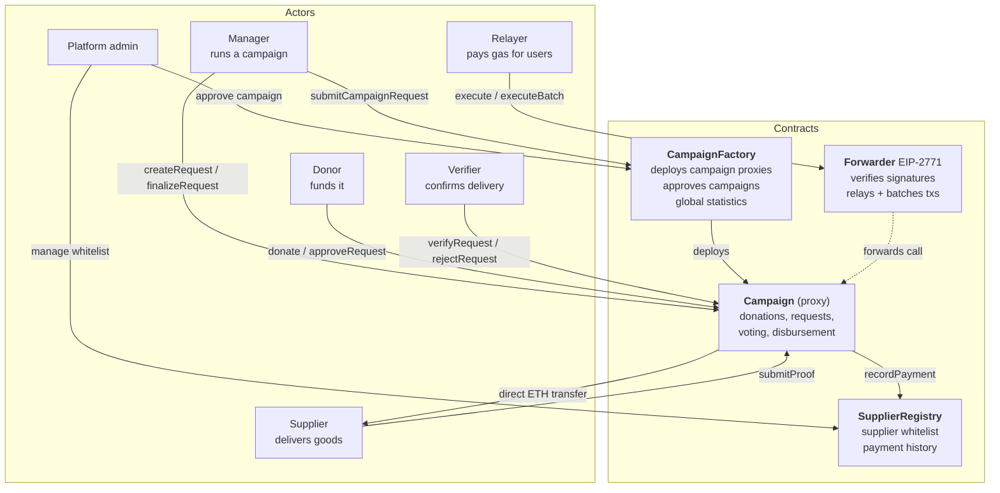
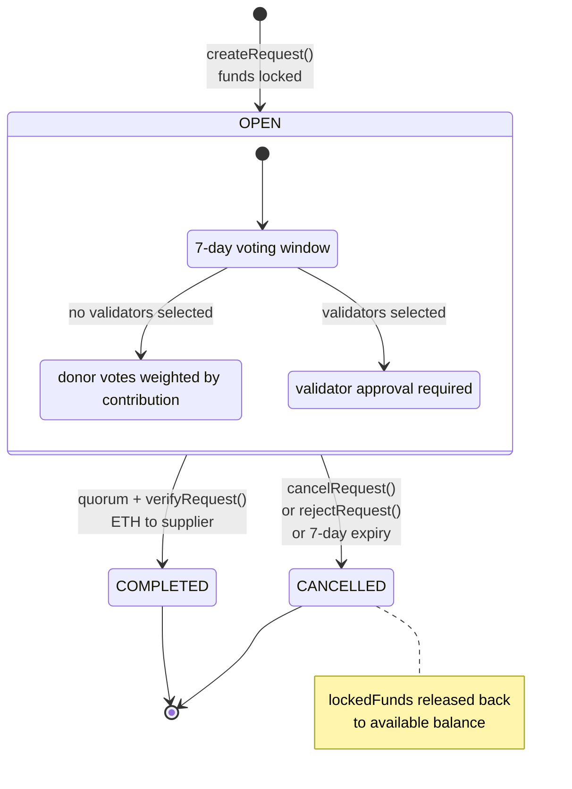
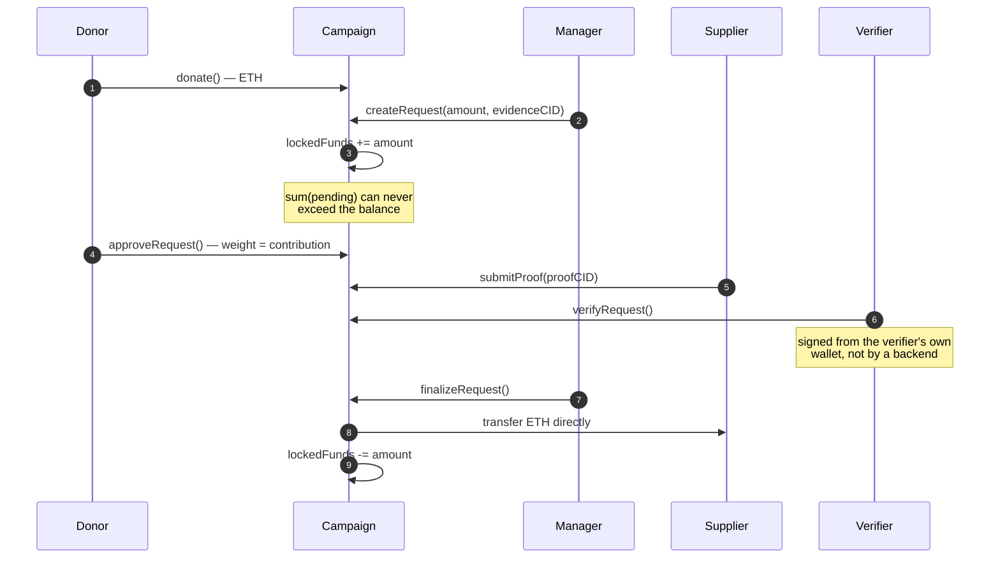

# Fundraising Blockchain

A decentralised fundraising platform where donors can verify how their money was spent —
without having to take anyone's word for it.

Deployed and live on the **Sepolia testnet**. Solidity contracts, a NestJS backend for IPFS
evidence storage, and a React frontend.

---

## The design question

Charitable fundraising has one hard problem: **the donor cannot see what happened to the
money.** Every conventional answer to that is a promise — an audit report, a receipt photo, a
trusted intermediary. All of them require trusting someone.

This system was built by asking, for each step, *"what would we otherwise have to trust, and can
we remove the need to trust it?"*

| Normally you must trust… | Instead |
|---|---|
| The manager's claim about how funds were spent | Evidence is pinned to **IPFS** and its **CID anchored on-chain**. Alter the document and the hash no longer matches. |
| The backend server to sign approvals honestly | Off-chain ECDSA signing was **removed entirely**. Suppliers submit proof and verifiers approve **directly from their own wallets**, on-chain. A compromised backend cannot forge an approval. |
| The manager not to over-commit the budget | Funds are **locked when a request is created**. The sum of pending requests can never exceed the campaign balance — over-commitment is not a policy, it is unrepresentable. |
| A request not to sit unresolved forever | A **7-day voting deadline**. Requests that fail to reach quorum expire and their locked funds return to the available balance. |

The pattern is the same in each row: rather than detecting a bad outcome after the fact, make it
impossible for the contract to enter that state.

---

## Deployed contracts — Sepolia

Verifiable on-chain, not screenshots:

| Contract | Address |
|---|---|
| CampaignFactory | [`0xd4C004D1214056DaC2f76e4DbA35CEc1028a8028`](https://sepolia.etherscan.io/address/0xd4C004D1214056DaC2f76e4DbA35CEc1028a8028) |
| SupplierRegistry | [`0xab4E38AC7de5b90Dd21AD1EB5742e51d7f7f91c5`](https://sepolia.etherscan.io/address/0xab4E38AC7de5b90Dd21AD1EB5742e51d7f7f91c5) |
| Forwarder (meta-tx) | [`0x26aCb6E756C2b014C247A86c9614C8bf511AE33B`](https://sepolia.etherscan.io/address/0x26aCb6E756C2b014C247A86c9614C8bf511AE33B) |

---

## Architecture

Four contracts, four roles. No single party can move money alone.



Note the last two edges: funds go **from the contract straight to the supplier**. The manager
never holds them.

## Request lifecycle

A spending request is a state machine, not a set of boolean flags. Funds are locked on entry
and released on exit — whichever exit is taken.



Three statuses (`OPEN`, `COMPLETED`, `CANCELLED`) and a separate verification status
(`PENDING`, `APPROVED`, `REJECTED`). Multi-stage requests advance one milestone at a time,
each requiring its own proof and verification.

## Disbursement protocol



## Defence in depth

```mermaid
graph LR
    subgraph L1["1 — Access control"]
        A1["onlyManager"]
        A2["onlyAdmin"]
        A3["onlyActive"]
        A4["isChildCampaign"]
    end
    subgraph L2["2 — Business rules"]
        B1["weighted voting"]
        B2["validator threshold"]
        B3["snapshot at request time<br/>blocks vote gaming"]
        B4["7-day voting period"]
    end
    subgraph L3["3 — Cryptography"]
        C1["EIP-712 meta-tx signatures"]
        C2["nonce — replay protection"]
    end
    subgraph L4["4 — Financial safety"]
        D1["supplier whitelist"]
        D2["lockedFunds reservation"]
        D3["ReentrancyGuard"]
        D4["direct transfer,<br/>never via the manager"]
    end
    L1 --> L2 --> L3 --> L4
```



Voting weight is snapshotted at request creation (`snapshotTotalFunds`), so donating *after* a
request opens cannot swing its outcome.

## Contracts and tests

```
bc/contracts/
  Campaign.sol            652 lines   campaign lifecycle, requests, voting, disbursement
  CampaignFactory.sol     460 lines   deployment + registry of campaigns
  SupplierRegistry.sol    223 lines   supplier identity and eligibility
  Events.sol              144 lines
  Forwarder.sol            71 lines   EIP-2771 meta-transactions (gasless UX)
  RequestLib.sol           64 lines
  Errors.sol               65 lines   custom errors (cheaper than revert strings)
  modifiers/AccessControl.sol
```

**2,348 lines of tests against 1,699 lines of contracts** — more test code than contract code:

| Suite | Covers |
|---|---|
| `Campaign.ts` (1,232 lines) | Full lifecycle: donate, request, vote, release, refund |
| `Campaign_WithdrawalOptimization.test.ts` | Gas behaviour of the withdrawal path |
| `RefundAndFees.test.ts` | Refund correctness and fee accounting |
| `SecurityValidations.ts` | Access control and input validation |
| `Hardening.test.ts` | Adversarial cases |
| `MetaTx.test.ts` | Meta-transaction relaying via the Forwarder |
| `Optimization.test.ts` | Gas regression checks |
| `CampaignApproval.ts` | Approval quorum logic |

```bash
cd bc && yarn hardhat test
```

---

## Repository layout

A monorepo with three independent parts:

| Directory | Stack | Responsibility |
|---|---|---|
| [`bc/`](bc/) | Solidity, Hardhat, Ethers.js, OpenZeppelin | Smart contracts and test suite |
| [`be/`](be/) | NestJS, Pinata SDK | Pins evidence to IPFS, returns the CID |
| [`fe/`](fe/) | React, Vite, TypeScript, Tailwind | Donor and manager interface |

Further reading: [money flow](bc/MONEY_FLOW.md) ·
[contract documentation](bc/docs/) · [frontend requirements](FE_FUNCTIONAL_REQUIREMENTS.md)

> ⚠️ `bc/docs/` predates the move to on-chain verification. Several diagrams there still show
> a verifier signing off-chain with ECDSA and the backend relaying that signature. The
> contracts no longer work that way — `Campaign.sol` exposes `submitProof`, `verifyRequest`
> and `rejectRequest` as ordinary on-chain calls. Treat this README and the contracts as
> authoritative until those documents are updated.

---

## Running it

```bash
# Contracts
cd bc && yarn install && yarn hardhat test

# Backend (needs a Pinata JWT — see be/.env.example)
cd ../be && yarn install && cp .env.example .env && yarn start:dev

# Frontend
cd ../fe && yarn install && yarn dev
```

`bc/` and `be/` both need a `.env`; each directory has its own `.env.example` and README.

> Never commit `.env`. The backend's Pinata JWT grants write access to your IPFS pinning
> account.

---

## Notes on the design

**Why store only the CID on-chain.** An earlier revision wrote campaign and request metadata
into `bytes32` fields, which capped field lengths and cost gas proportional to the data. Now the
full metadata object is pinned to IPFS and only the CID string is stored. Storage cost is flat
regardless of description length, and the content stays tamper-evident because the CID *is* the
hash.

**Why remove off-chain signatures.** The first version had the backend sign verification
approvals with ECDSA. That made the backend a trusted party — compromise it and you could
approve any disbursement. Moving verification fully on-chain means an attacker needs a
verifier's private key, not a server.

**Why lock funds at request time.** Without reservation, a manager could open requests totalling
more than the balance and whichever cleared first would drain the campaign. Locking on creation
makes the invariant *sum(pending) ≤ balance* hold by construction rather than by checking.

---

## Credits

Team project for a Smart Contract Programming course.

**Duy Tien Nguyen** — smart contracts (`bc/`) and backend (`be/`): the campaign and request
state machine, fund-locking, the on-chain verification flow, and the NestJS service that pins
evidence to IPFS and returns the CID anchored on-chain.

Frontend (`fe/`) and presentation materials by other team members. See the commit history for
the full breakdown.

## License

See [LICENSE](LICENSE).
