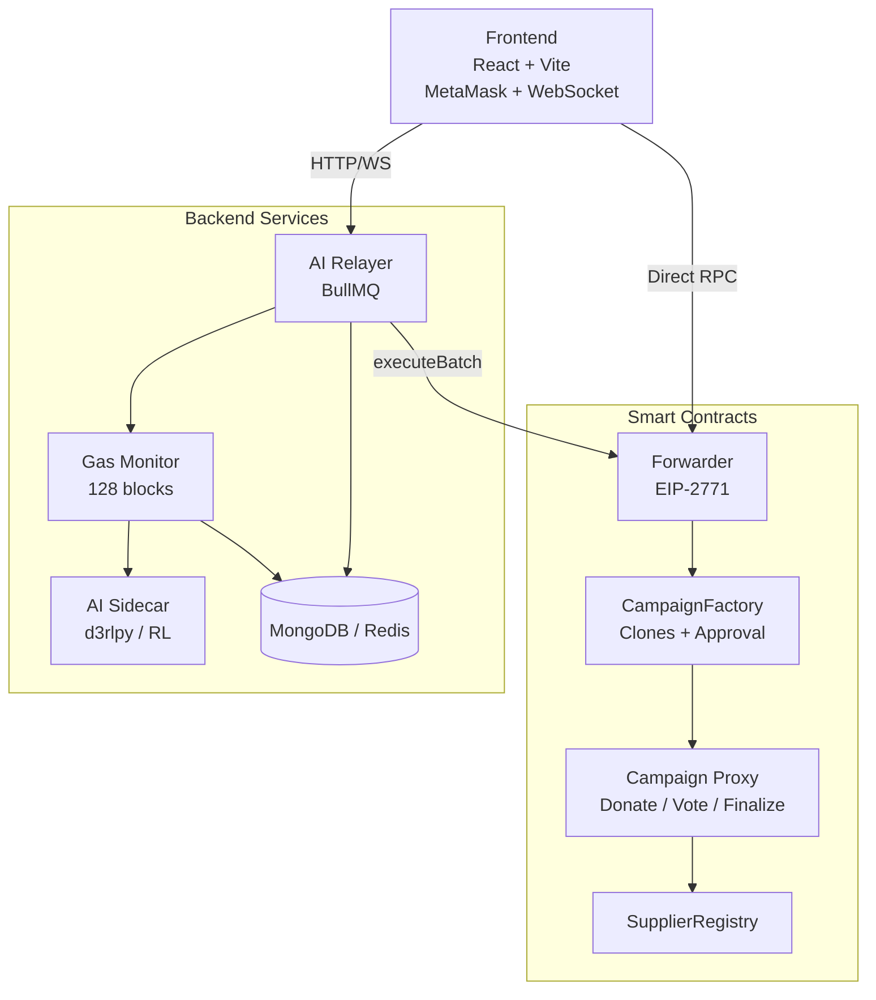
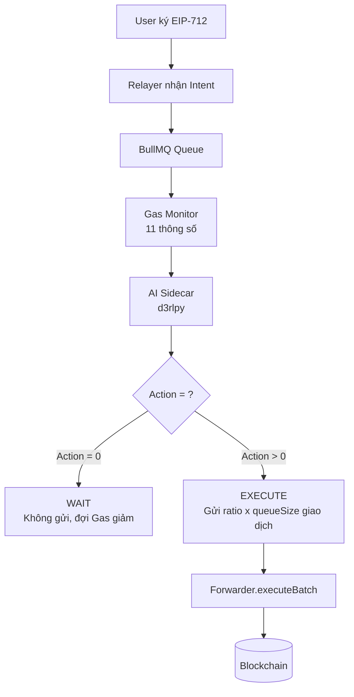
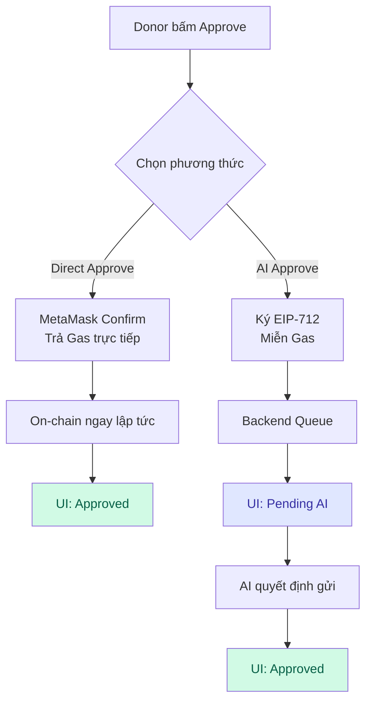
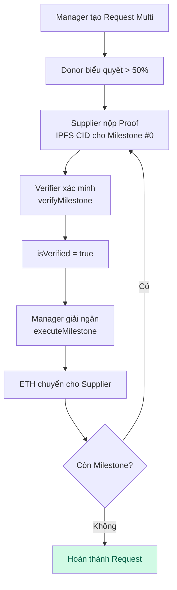
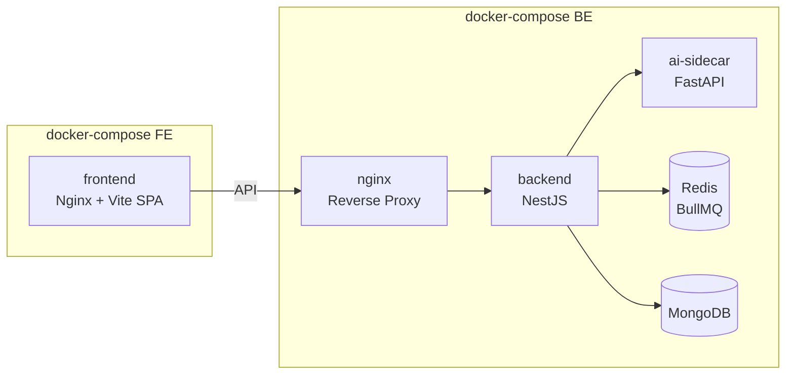

# NỘI DUNG SLIDE BÁO CÁO ĐỒ ÁN
## Nền tảng Gây quỹ Phi tập trung với Tối ưu Gas bằng AI (Reinforcement Learning)

---

# PHẦN 1: CƠ SỞ LÝ THUYẾT

---

## Slide 1.1: Blockchain và Smart Contract

- **Blockchain**: Sổ cái phân tán, bất biến, không cần bên trung gian tin cậy
- **Ethereum**: Nền tảng hợp đồng thông minh phổ biến nhất, hỗ trợ ngôn ngữ Solidity
- **Smart Contract**: Chương trình tự thực thi trên blockchain, đảm bảo tính minh bạch và không thể can thiệp
- **EVM (Ethereum Virtual Machine)**: Máy ảo thực thi bytecode của smart contract trên mọi node trong mạng
- **Gas Fee**: Chi phí tính toán trên Ethereum, đo bằng đơn vị Gas × Gas Price (Gwei)

## Slide 1.2: Cơ chế Gas trên Ethereum (EIP-1559)

- **Base Fee**: Phí cơ sở do giao thức tự điều chỉnh theo mức độ tắc nghẽn mạng
- **Priority Fee (Tip)**: Phí ưu tiên người dùng trả thêm cho miner/validator
- **Biến động Gas**: Base Fee có thể tăng/giảm tối đa 12.5% mỗi block (~12 giây)
- **Vấn đề**: Người dùng phải chịu chi phí Gas không thể dự đoán trước, đặc biệt khi mạng tắc nghẽn

## Slide 1.3: Meta-Transaction và EIP-2771

- **Meta-Transaction**: Cho phép người dùng ký giao dịch offline, bên thứ ba (Relayer) trả Gas thay
- **EIP-2771 (Trusted Forwarder)**: Chuẩn giao thức cho phép smart contract nhận diện người gửi thực sự thông qua Forwarder đáng tin cậy
- **EIP-712 (Typed Structured Data)**: Chuẩn ký dữ liệu có cấu trúc, giúp người dùng xác nhận rõ nội dung giao dịch trước khi ký
- **Lợi ích**: Người dùng không cần giữ ETH để trả Gas → Giảm rào cản gia nhập

## Slide 1.4: Reinforcement Learning (RL) cho Tối ưu Gas

- **Reinforcement Learning**: Agent học cách hành động tối ưu thông qua tương tác với môi trường, nhận phần thưởng/phạt
- **Offline RL (d3rlpy)**: Huấn luyện Agent từ dữ liệu lịch sử (batch data) thay vì tương tác trực tiếp với môi trường thật
- **State Vector (11 chiều)**:
  - `s_gas_t0, s_gas_t1, s_gas_t2`: Giá Gas 3 block gần nhất
  - `s_congestion`: Mức độ tắc nghẽn mạng
  - `s_momentum, s_accel`: Xu hướng và gia tốc biến động Gas
  - `s_surprise`: Độ bất thường số lượng giao dịch
  - `s_backlog`: Chỉ số tích tụ tắc nghẽn
  - `s_queue`: Số lượng giao dịch trong hàng đợi
  - `s_time_left`: Thời gian còn lại trước deadline
  - `s_gas_ref`: Giá Gas tham chiếu (trung bình 128 block)
- **Action Space**: 5 mức `{0%, 25%, 50%, 75%, 100%}` — tỷ lệ giao dịch trong hàng đợi sẽ được gửi đi

## Slide 1.5: IPFS và Lưu trữ Phi tập trung

- **IPFS (InterPlanetary File System)**: Hệ thống lưu trữ phi tập trung, định danh nội dung bằng CID (Content Identifier)
- **Tại sao dùng IPFS?**: Lưu dữ liệu lớn (mô tả, hình ảnh) trên blockchain rất tốn kém → Chỉ lưu CID (46 bytes) trên chain, dữ liệu thực nằm trên IPFS
- **Pinata**: Dịch vụ IPFS Pinning đảm bảo dữ liệu luôn sẵn có

## Slide 1.6: Proxy Pattern và Clones (EIP-1167)

- **Minimal Proxy (Clones)**: Kỹ thuật tạo bản sao smart contract với chi phí Gas cực thấp (~45,000 Gas thay vì ~2,000,000 Gas)
- **Implementation Contract**: Bản mẫu chứa toàn bộ logic, chỉ deploy 1 lần
- **Proxy Contract**: Bản sao nhẹ, ủy quyền mọi lời gọi đến Implementation
- **Ứng dụng**: Mỗi Campaign mới là một Proxy clone → Tiết kiệm ~97% Gas khi tạo chiến dịch

---

# PHẦN 2: PHÂN TÍCH VÀ THIẾT KẾ HỆ THỐNG

---

## Slide 2.1: Tổng quan Kiến trúc Hệ thống

```
┌─────────────────────────────────────────────────────┐
│                    FRONTEND (React + Vite)           │
│  Pages: Home, Campaigns, CampaignDetail, Admin,     │
│         Creator, Verifier, Supplier Dashboards       │
│  Kết nối: MetaMask (viem) + WebSocket (Socket.io)   │
└────────────┬──────────────────────┬──────────────────┘
             │ HTTP/WS              │ Direct RPC
             ▼                      ▼
┌────────────────────┐    ┌────────────────────────────┐
│   BACKEND (NestJS) │    │   BLOCKCHAIN (Sepolia)     │
│  ┌──────────────┐  │    │  ┌──────────────────────┐  │
│  │ AI Relayer   │──┼────┼─→│ Forwarder (EIP-2771) │  │
│  │ (BullMQ)     │  │    │  └──────────┬───────────┘  │
│  └──────┬───────┘  │    │             ▼              │
│         │          │    │  ┌──────────────────────┐  │
│  ┌──────▼───────┐  │    │  │ CampaignFactory      │  │
│  │ Gas Monitor  │  │    │  │ (Clones + Approval)  │  │
│  │ (128 blocks) │  │    │  └──────────┬───────────┘  │
│  └──────┬───────┘  │    │             ▼              │
│         │          │    │  ┌──────────────────────┐  │
│  ┌──────▼───────┐  │    │  │ Campaign (Proxy)     │  │
│  │ AI Sidecar   │  │    │  │ Donate/Vote/Finalize │  │
│  │ (d3rlpy/RL)  │  │    │  └──────────────────────┘  │
│  └──────────────┘  │    │  ┌──────────────────────┐  │
│  ┌──────────────┐  │    │  │ SupplierRegistry     │  │
│  │ MongoDB      │  │    │  └──────────────────────┘  │
│  │ Redis        │  │    └────────────────────────────┘
│  └──────────────┘  │
└────────────────────┘
```



## Slide 2.2: Smart Contract — CampaignFactory

- **Vai trò**: Contract trung tâm quản lý vòng đời tạo chiến dịch
- **Quy trình tạo Campaign**:
  1. Manager gửi yêu cầu + phí chống spam (0.005 ETH)
  2. Admin duyệt/từ chối (từ chối → hoàn 80% phí)
  3. Nếu duyệt → Deploy Proxy Campaign bằng `Clones.clone()`
- **Tính năng chính**:
  - Phân loại Campaign theo Category (MEDICAL, EDUCATION, DISASTER, COMMUNITY, OTHER)
  - Thống kê toàn cục: tổng tiền đã quyên góp
  - Quản lý danh sách Campaign theo Manager
  - Theo dõi lịch sử donate của từng User

## Slide 2.3: Smart Contract — Campaign

- **Vai trò**: Quản lý một chiến dịch gây quỹ cụ thể
- **Tính năng cốt lõi**:
  - **Donate**: Nhận đóng góp, ghi nhận donor ID (thứ tự tham gia)
  - **Create Request**: Tạo yêu cầu chi tiêu (Single hoặc Multi-stage Milestone)
  - **Approve Request**: Biểu quyết có trọng số (Weight = số ETH đã donate)
  - **Finalize Request**: Giải ngân khi đạt ngưỡng >50% tổng quỹ
  - **Validator System**: Chọn ngẫu nhiên 3 donor làm Validator cho request nhỏ (<0.5% tổng quỹ)
  - **Claim Refund**: Hoàn tiền theo tỷ lệ khi Campaign bị đóng

- **Cơ chế bảo mật**:
  - `ReentrancyGuard`: Chống tấn công re-entrancy
  - `Snapshot`: Ghi nhận trạng thái donor tại thời điểm tạo request
  - ECDSA Signature: Xác thực Verifier trước khi giải ngân

## Slide 2.4: Smart Contract — Forwarder & SupplierRegistry

**Forwarder (Meta-Transaction)**:
- Triển khai chuẩn EIP-2771 + EIP-712
- Xác thực chữ ký Typed Data của người dùng
- Hỗ trợ `executeBatch()`: Gom nhiều giao dịch vào 1 mẻ → Tiết kiệm 21,000 Gas/giao dịch

**SupplierRegistry (Sổ cái Nhà cung cấp)**:
- Danh sách trắng (Whitelist) các nhà cung cấp uy tín
- Ghi nhận lịch sử thanh toán từ các Campaign
- Chỉ Campaign hợp lệ (do Factory tạo) mới được phép ghi dữ liệu

## Slide 2.5: Backend — AI Gas Optimization Pipeline

```
Người dùng ký EIP-712  →  Relayer nhận Intent  →  BullMQ Queue
                                                       │
                         ┌─────────────────────────────┘
                         ▼
                   ┌───────────┐     ┌─────────────┐
                   │Gas Monitor│────→│  AI Sidecar  │
                   │(11 params)│     │  (d3rlpy)    │
                   └───────────┘     └──────┬──────┘
                                            │
                                     Action: 0-4
                                            │
                         ┌──────────────────┘
                         ▼
              ┌─────────────────────┐
              │ WAIT (Action=0)     │ → Không gửi, đợi Gas giảm
              │ EXECUTE (Action>0)  │ → Gửi ratio × queueSize giao dịch
              └─────────┬───────────┘
                        │
                        ▼
              Forwarder.executeBatch() → Blockchain
```



- **Chu kỳ quyết định**: Mỗi 15 giây (Cron job)
- **11 thông số trạng thái** được tính từ 128 block gần nhất
- **Tiết kiệm Gas đến từ 2 nguồn**:
  - Batching: Tiết kiệm 21,000 Gas × (n-1) giao dịch
  - Timing: AI chờ đợi khi Gas cao, gửi khi Gas thấp

## Slide 2.6: Backend — Công nghệ và Dịch vụ

| Thành phần | Công nghệ | Vai trò |
|---|---|---|
| API Server | NestJS + TypeScript | REST API, Swagger docs |
| Message Queue | BullMQ + Redis | Hàng đợi giao dịch chờ tối ưu |
| AI Model | d3rlpy (Offline RL) + FastAPI | Quyết định thời điểm gửi giao dịch |
| Database | MongoDB + Mongoose | Lưu lịch sử Gas, thống kê AI |
| Real-time | Socket.io (WebSocket) | Cập nhật trạng thái AI cho Frontend |
| Blockchain | ethers.js v6 | Tương tác với smart contract |

## Slide 2.7: Frontend — Kiến trúc và Tính năng

**Công nghệ**: React 18 + TypeScript + Vite + TailwindCSS

**Các trang chính**:

| Trang | Chức năng |
|---|---|
| Home | Landing page, giới thiệu nền tảng |
| Campaigns | Danh sách chiến dịch, lọc theo Category |
| Campaign Detail | Chi tiết chiến dịch, donate, vote, finalize |
| Create Campaign | Form tạo chiến dịch mới (upload IPFS) |
| Admin Dashboard | Duyệt/từ chối yêu cầu tạo chiến dịch |
| Creator Dashboard | Quản lý chiến dịch đã tạo |
| Verifier Dashboard | Xác minh minh chứng chi tiêu |
| Supplier Dashboard | Theo dõi thanh toán |
| Activity | Lịch sử hoạt động toàn cầu |

**Tính năng UX nổi bật**:
- Kết nối MetaMask qua `viem` + `window.ethereum`
- Cập nhật real-time trạng thái AI Relayer qua WebSocket
- Dual Approve: Chọn Direct (tự trả Gas) hoặc AI (miễn Gas, chờ tối ưu)
- Toast Notification toàn cục (NotificationProvider)

## Slide 2.8: Sơ đồ Luồng Biểu quyết (Governance Voting)

```
                    Donor bấm "Approve"
                           │
                ┌──────────┴──────────┐
                ▼                     ▼
        ⚡ Direct Approve      🛡️ AI Approve
        (Trả Gas trực tiếp)   (Ký EIP-712, miễn Gas)
                │                     │
                ▼                     ▼
        MetaMask Confirm        Backend Queue
                │                     │
                ▼                     ▼
        On-chain ngay lập tức   AI chờ Gas tối ưu
                │                     │
                ▼                     ▼
        UI → ✅ "Approved"      UI → ⏳ "Pending AI"
                                      │
                                      ▼ (AI quyết định gửi)
                                UI → ✅ "Approved"
```



## Slide 2.9: Sơ đồ Luồng Chi tiêu (Multi-stage Milestone)

```
Manager tạo Request (Multi) → Donor biểu quyết (>50%)
        │
        ▼
Supplier nộp Proof (IPFS CID) cho Milestone #0
        │
        ▼
Verifier xác minh (verifyMilestone) → ✅ isVerified = true
        │
        ▼
Manager giải ngân (executeMilestone) → ETH → Supplier
        │
        ▼
Lặp lại cho Milestone #1, #2, ... → Hoàn thành Request
```



## Slide 2.10: Deployment Architecture (Docker)

```
docker-compose (BE)                docker-compose (FE)
┌──────────────────────┐          ┌──────────────────┐
│ backend (NestJS)     │          │ frontend (Nginx) │
│ ai-sidecar (FastAPI) │          │ Vite build → SPA │
│ redis (BullMQ)       │          └──────────────────┘
│ mongodb              │
│ nginx (Reverse Proxy)│
└──────────────────────┘
```



- **Testnet**: Ethereum Sepolia
- **IPFS**: Pinata (pinning service)
- **Containerized**: Docker Compose cho cả BE và FE

---

# PHẦN 3: THỬ NGHIỆM VÀ ĐÁNH GIÁ

---

## Slide 3.1: Môi trường Thử nghiệm

| Thông số | Giá trị |
|---|---|
| Blockchain Network | Ethereum Sepolia Testnet |
| Solidity Version | ^0.8.28 |
| Node.js | v22 (FE) / v20 (BE) |
| AI Framework | d3rlpy (Offline RL) |
| Browser | Chrome + MetaMask Extension |
| Deployment | Docker Compose (Ubuntu Linux) |

## Slide 3.2: Kịch bản Thử nghiệm — Tạo và Quản lý Campaign

| Bước | Hành động | Kết quả mong đợi |
|---|---|---|
| 1 | Manager tạo Campaign + trả 0.005 ETH | Request PENDING |
| 2 | Admin duyệt trên Admin Dashboard | Campaign deploy (Proxy Clone) |
| 3 | Donor donate ETH vào Campaign | Số dư tăng, donor count +1 |
| 4 | Manager tạo Spending Request | Request OPEN, lock funds |
| 5 | Donor biểu quyết (Direct hoặc AI) | Approval weight tăng |
| 6 | Manager Finalize khi đạt >50% | ETH chuyển cho Supplier |

## Slide 3.3: Kịch bản Thử nghiệm — AI Gas Optimization

| Thông số | Giá trị đo được |
|---|---|
| Số lượng giao dịch thử nghiệm | ~50 intents |
| Batch size trung bình | 2-5 giao dịch/mẻ |
| Gas tiết kiệm từ Batching | ~21,000 Gas × (n-1) / mẻ |
| Gas tiết kiệm từ Timing | Phụ thuộc biến động Gas Price |
| Thời gian chờ trung bình | 15s - 5 phút |
| Chu kỳ AI quyết định | Mỗi 15 giây |

**Cơ chế đánh giá tiết kiệm**:
- `Batching Benefit = (batchSize - 1) × 21,000 × currentGasPrice`
- `Timing Benefit = batchSize × max(0, gasRef - currentGas) × 21,000`

## Slide 3.4: Kịch bản Thử nghiệm — Bảo mật

| Test Case | Mô tả | Kết quả |
|---|---|---|
| Manager tự donate | Gọi `donate()` với ví Manager | ❌ Revert: `ManagerCannotDonate` |
| Manager tự vote | Gọi `approveRequest()` với ví Manager | ❌ Revert: `ManagerCannotVote` |
| Donor vote sau khi tạo request | donorId > snapshotDonorCount | ❌ Revert: `JoinedAfterRequest` |
| Re-entrancy attack | Hợp đồng ác ý gọi lại `finalizeRequest` | ❌ Blocked: `ReentrancyGuard` |
| Chữ ký EIP-712 giả | Ký với private key khác | ❌ Revert: Signature mismatch |
| Finalize chưa đủ vote | totalApprovalWeight ≤ 50% | ❌ Revert: `NotEnoughApprovals` |
| Recipient không nằm trong Whitelist | Gọi createRequest với địa chỉ chưa đăng ký | ❌ Revert: `RecipientNotWhitelisted` |

## Slide 3.5: Đánh giá Ưu điểm

1. **Minh bạch tuyệt đối**: Mọi giao dịch (donate, vote, finalize) đều được ghi nhận on-chain, bất kỳ ai cũng có thể kiểm tra
2. **Phi tập trung hoàn toàn**: Không có bên trung gian nắm giữ tiền — Quỹ nằm trong smart contract
3. **Quản trị cộng đồng**: Biểu quyết có trọng số (1 ETH = 1 phiếu), đảm bảo quyền lợi donor lớn
4. **Tối ưu chi phí bằng AI**: Giảm đáng kể Gas Fee cho người dùng thông qua Batching + Timing
5. **UX thân thiện**: Người dùng có thể chọn Direct (nhanh, tự trả) hoặc AI (miễn phí, chờ tối ưu)
6. **Kiến trúc mở rộng**: Proxy Clone giúp tạo Campaign mới với chi phí cực thấp (~97% tiết kiệm Gas)

## Slide 3.6: Đánh giá Hạn chế

1. **Phụ thuộc Testnet**: Chưa triển khai trên Mainnet, Gas dynamics có thể khác biệt
2. **AI Model offline**: Model RL được huấn luyện offline, chưa có cơ chế tự cập nhật (online learning)
3. **Độ trễ AI**: Giao dịch AI có thể chờ vài phút → Không phù hợp cho trường hợp khẩn cấp
4. **Scalability**: Mỗi Campaign là một contract riêng, số lượng lớn có thể gây tốn tài nguyên quét log
5. **UX Blockchain**: Vẫn yêu cầu người dùng cài MetaMask và hiểu cơ bản về ví điện tử

---

# PHẦN 4: KẾT LUẬN VÀ HƯỚNG PHÁT TRIỂN

---

## Slide 4.1: Kết luận

Đồ án đã xây dựng thành công một **nền tảng gây quỹ phi tập trung** trên Ethereum với các đóng góp chính:

1. **Hệ thống Smart Contract hoàn chỉnh**: CampaignFactory (Proxy Clone), Campaign (Governance Voting, Multi-stage Milestone), Forwarder (Meta-Transaction), SupplierRegistry (Whitelist Management)

2. **AI Gas Optimization**: Tích hợp Reinforcement Learning (d3rlpy) để tự động quyết định thời điểm gửi giao dịch tối ưu, kết hợp Batching và Timing để giảm chi phí Gas cho người dùng

3. **Giao diện Web hiện đại**: React + TypeScript với trải nghiệm người dùng mượt mà, hỗ trợ nhiều vai trò (Admin, Manager, Donor, Verifier, Supplier)

4. **Kiến trúc Microservices**: Backend NestJS + AI Sidecar (FastAPI) + Redis + MongoDB, đóng gói Docker Compose, dễ dàng triển khai và mở rộng

## Slide 4.2: Hướng phát triển

| Hướng | Mô tả |
|---|---|
| **Online RL** | Chuyển từ Offline sang Online Reinforcement Learning, cho phép AI tự cập nhật model theo dữ liệu thực tế |
| **Layer 2 Deployment** | Triển khai trên Arbitrum/Optimism/Base để giảm thêm chi phí Gas và tăng tốc độ giao dịch |
| **Cross-chain** | Hỗ trợ nhiều blockchain (Polygon, BSC, ...) thông qua bridge hoặc multi-chain deployment |
| **Mobile DApp** | Phát triển ứng dụng di động (React Native) tích hợp WalletConnect |
| **DAO Governance** | Nâng cấp quản trị thành DAO toàn diện với token voting và proposal system |
| **ZK-Proof Privacy** | Áp dụng Zero-Knowledge Proof cho phép donate ẩn danh nhưng vẫn chứng minh được quyền biểu quyết |
| **AI Fraud Detection** | Bổ sung mô hình AI phát hiện chiến dịch lừa đảo dựa trên on-chain patterns |
| **Mainnet Launch** | Kiểm thử kỹ lưỡng (Audit) và triển khai chính thức trên Ethereum Mainnet |

## Slide 4.3: Tổng kết Công nghệ

| Layer | Công nghệ |
|---|---|
| Smart Contract | Solidity 0.8.28, OpenZeppelin, Hardhat, Sepolia Testnet |
| Backend | NestJS, TypeScript, ethers.js v6, BullMQ, MongoDB, Redis |
| AI Engine | Python, d3rlpy, FastAPI, PyTorch |
| Frontend | React 18, TypeScript, Vite, viem, TailwindCSS |
| Infrastructure | Docker Compose, Nginx, IPFS (Pinata) |
| Standards | EIP-2771, EIP-712, EIP-1167 (Minimal Proxy) |
