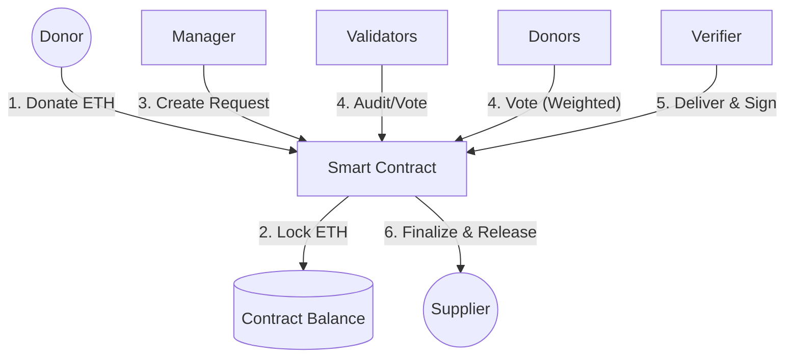

# 💸 Quy trình Luồng tiền & Giao dịch (Money Flow)

Tài liệu này giải thích chi tiết cách ETH được luân chuyển, bảo vệ và giải ngân trong hệ thống Fundraising Blockchain.

---

## 1. Tổng quan Luồng tiền (High-level)

---

## 2. Chi tiết các giai đoạn

### Giai đoạn 1: Đóng góp (Donation)
- **Hành động**: Donor gửi ETH vào hàm `donate()`.
- **Cơ chế**:
    - ETH được khóa vĩnh viễn trong địa chỉ của Smart Contract Campaign.
    - Không ai (kể cả Manager) có quyền rút tiền trực tiếp.
    - Trọng số biểu quyết (Voting Power) được tính dựa trên số ETH đã đóng góp.

### Giai đoạn 2: Tạo yêu cầu chi tiêu (Request Creation)
- **Hành động**: Manager tạo Request để mua hàng hóa/dịch vụ từ một **Supplier** đã được Admin phê duyệt (Whitelist).
- **Cơ chế Bảo mật (Budget Reservation)**: 
    - Ngay khi tạo, số tiền yêu cầu sẽ bị khóa (`lockedFunds`).
    - Đảm bảo tính khả dụng của quỹ, không cho phép tạo request vượt quá số dư thực tế.
- **Yêu cầu**: 
    - Phải có bằng chứng (hóa đơn/báo giá) lưu trên IPFS.
    - Phải chỉ định một **Verifier** (bên thứ 3 độc lập).

### Giai đoạn 3: Biểu quyết & Kiểm soát (Governance)
Hệ thống sử dụng cơ chế bảo mật đa tầng:
1.  **Weighted Voting**: Cần >50% tổng số vốn của chiến dịch đồng ý.
2.  **Validator Audit**: Chọn ngẫu nhiên 3 Validators từ pool donor.
3.  **Hạn chót (Voting Period)**: Donors phải biểu quyết trong vòng **7 ngày**. Sau thời gian này, yêu cầu sẽ hết hạn và không thể giải ngân.
4.  **Cơ chế Hủy (Cancellation)**: Manager có thể hủy Request (`CANCELLED`) nếu không còn cần thiết, giúp giải phóng ngay lập tức số tiền đã bị khóa.

### Giai đoạn 4: Nghiệm thu & Giải ngân (Two-Stage Disbursement)
Đây là chuẩn bảo mật **WFP (World Food Programme)**:
1.  **Giai đoạn 1 (Approval)**: Biểu quyết thành công (Vote PASS). Trạng thái Request chuyển sang hợp lệ.
2.  **Giai đoạn 2 (Delivery & Verification)**: 
    - Supplier giao hàng.
    - Verifier kiểm tra và tạo một **ECDSA Signature**.
    - Manager dùng chữ ký này để gọi hàm `finalizeRequest`.
    - Smart Contract xác thực chữ ký -> Chuyển ETH thẳng vào ví Supplier và đổi trạng thái sang `COMPLETED`.

---

## 3. Các biện pháp bảo mật giao dịch

### Chống rút tiền trái phép
- **Supplier Registry**: Tiền chỉ có thể gửi tới các địa chỉ ví của Supplier đã được Platform Admin xác minh danh tính.
- **Direct Transfer**: Smart Contract chuyển tiền trực tiếp cho Supplier, không thông qua ví của Manager, tránh rủi ro "cuỗm tiền".

### Chống tấn công kỹ thuật
- **Re-entrancy Guard**: Sử dụng `nonReentrant` của OpenZeppelin để ngăn chặn việc rút tiền nhiều lần trong một giao dịch.
- **Checks-Effects-Interactions**: Luôn cập nhật trạng thái "Đã hoàn thành" (`complete = true`) trước khi thực hiện lệnh chuyển tiền.

### Tính minh bạch tuyệt đối
- Mọi lịch sử giải ngân, chữ ký của Verifier và bằng chứng IPFS đều được lưu trữ On-chain hoặc Event Logs, không thể xóa sửa.

---
*Cập nhật bởi Antigravity AI — Phiên bản 4.0*
