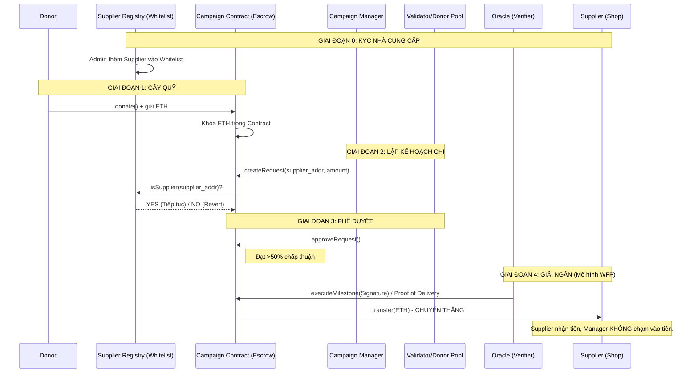

# 💸 Fundraising - Giao Thức Luân Chuyển Dòng Tiền (Money Transfer Protocol)

Tài liệu này giải thích chi tiết cách dòng tiền (ETH) di chuyển trong hệ thống **Fundraising** (Humanitarian Accountability Protocol), từ lúc Donor đóng góp đến khi Nhà cung cấp nhận được thanh toán cuối cùng.

---

## 🏗️ Tổng Quan Kiến Trúc Dòng Tiền

Khác với các nền tảng gây quỹ truyền thống, trong dự án **Fundraising**, **Smart Contract đóng vai trò là "Ngân hàng ủy thác" (Escrow)**. Tiền không bao giờ nằm trong túi cá nhân của Manager.

### Quy Trình 3 Chặng

1.  **Chặng 1 (Nạp):** Donor ➡️ Campaign Contract (Tiền bị khóa).
2.  **Chặng 2 (Duyệt):** Manager ➡️ Donors/Validators (Biểu quyết lệnh chi).
3.  **Chặng 3 (Xác thực & Chuyển):** Verifier (Proof of Delivery) ➡️ Supplier (Giải ngân tự động).

---

## 📊 Sơ Đồ Luồng Hoạt Động

---

## 🔒 Cơ Chế Bảo Mật Tầng (Layered Security)

### 1. Whitelist Enforcement (Danh sách trắng)
*   **Điều kiện:** Mọi địa chỉ nhận tiền (`recipient`) phải được đăng ký trong `SupplierRegistry`.
*   **Mục đích:** Ngăn chặn Manager dự án **Fundraising** tạo ví ảo hoặc dùng ví cá nhân để rút tiền trái phép.
*   **Logic:** `if (!supplierRegistry.isSupplier(recipient)) revert RecipientNotWhitelisted();`

### 2. Ngưỡng Giải Ngân (Hybrid Approval Threshold)
Hệ thống tự động phân loại rủi ro dựa trên số dư hiện tại của quỹ:
*   **Dưới 0.5% (Chi phí nhỏ):** Chỉ cần 3 Validator ngẫu nhiên duyệt để đẩy nhanh tiến độ.
*   **Trên 0.5% (Chi phí lớn):** Bắt buộc toàn bộ cộng đồng Donors phải biểu quyết (>50%).

---

## ⚙️ Chi Tiết 2 Luồng Giải Ngân Chính

### Luồng A: Giải Ngân Cho Các Lệnh Chi Nhỏ (Path A)
Dùng cho văn phòng phẩm, tiền điện, nước...
1.  **Manager** tạo request nhắm tới một Supplier.
2.  **Validator Pool** kiểm tra chứng từ qua hình ảnh/báo cáo.
3.  **2/3 Validator** nhấn `approve`.
4.  **Manager** nhấn `finalizeRequest`. Hệ thống chuyển ETH từ Contract cho Supplier.

### Luồng B: Giải Ngân Đa Tầng Theo Cột Mốc (Path B - Proof of Delivery)
Dùng cho các dự án xây dựng hoặc mua sắm vật liệu lớn.
1.  **Manager** tạo `MultiStageRequest` chia làm nhiều giai đoạn.
2.  **Donor** duyệt tổng ngân sách một lần duy nhất.
3.  **Supplier** thực hiện xong từng giai đoạn.
4.  **Verifier (Bên thứ 3)** xác thực thực tế và ký mã bảo mật (ECDSA Signature).
5.  **Manager** gọi hàm `executeMilestone(signature)`.
6.  **Smart Contract** xác thực chữ ký và tự động chuyển tiền từng mốc cho Supplier.

---

## 🛠️ Trạng Thái Của Dòng Tiền Trong Code

| Trạng thái | Ý nghĩa | Hành động tiếp theo |
|---|---|---|
| **Funded** | ETH đang nằm trong ví Contract | Chờ Manager tạo Request |
| **Pending** | Request đã tạo, ETH đã được "ngỏ ý" sử dụng | Chờ duyệt (Voting) |
| **Approved** | Cộng đồng đã đồng ý chi | Chờ thực thi hoặc chờ Proof of Delivery |
| **Executed** | ETH đã được chuyển đi vĩnh viễn | Kết thúc vòng đời request |

---

## ⚠️ Những Lưu Ý Quan Trọng Trong Dự Án Fundraising

- **Tính Bất Biến:** Sau khi request đã được tạo, địa chỉ người nhận (`recipient`) không thể bị thay đổi bởi Manager.
- **Tiền chuyển thẳng:** Trong mọi trường hợp, tiền giải ngân đều đi trực tiếp từ Smart Contract đến ví Nhà cung cấp, tuyệt đối không đi qua ví trung gian của Manager.
- **Xác thực chữ ký:** Chữ ký số giúp mô phỏng quy trình "Kiểm tra thực địa" trước khi thanh toán, đảm bảo tiền chỉ được chi khi công việc đã hoàn thành.

---

## 🎯 Kết Luận
Cơ chế này giúp dự án **Fundraising** đạt được sự minh bạch tối đa, xây dựng niềm tin tuyệt đối cho người đóng góp bằng cách loại bỏ hoàn toàn khả năng chiếm dụng vốn của người quản lý.
