# 📊 Tổng kết kiến trúc bảo mật — Smart Contract Gây quỹ Blockchain

## Tổng quan

Tài liệu này tổng hợp 4 tầng bảo mật của hệ thống và danh sách 8 diagram chi tiết.

## Diagram tổng kết bảo mật

```mermaid
graph LR
    subgraph L1["Tầng 1: Quyền truy cập"]
        AC1["onlyManager modifier"]
        AC2["onlyAdmin modifier"]
        AC3["onlyActive modifier"]
        AC4["isChildCampaign check"]
    end
    
    subgraph L2["Tầng 2: Logic nghiệp vụ"]
        L21["Weighted Voting > 50%"]
        L22["Validator Audit ≥ 2/3"]
        L23["Snapshot chống gaming"]
        L24["Voting Period 7 ngày"]
    end
    
    subgraph L3["Tầng 3: Mật mã học"]
        C1["ECDSA Verifier Signature"]
        C2["EIP-712 Meta-Tx Signature"]
        C3["Nonce chống Replay"]
    end
    
    subgraph L4["Tầng 4: Tài chính"]
        F1["SupplierRegistry Whitelist"]
        F2["lockedFunds Reservation"]
        F3["ReentrancyGuard"]
        F4["Direct Transfer không qua Manager"]
    end

    L1 --> L2 --> L3 --> L4
```

## Danh sách Diagram

| # | File | Nội dung | Loại Diagram |
|---|---|---|---|
| 1 | [01-kien-truc-tong-quan.md](./01-kien-truc-tong-quan.md) | Kiến trúc tổng quan, quan hệ giữa contracts và vai trò | `graph TD` |
| 2 | [02-vong-doi-chien-dich.md](./02-vong-doi-chien-dich.md) | Vòng đời chiến dịch: PENDING → ACTIVE → INACTIVE → REFUND | `stateDiagram-v2` |
| 3 | [03-luong-quyen-gop.md](./03-luong-quyen-gop.md) | Luồng quyên góp: donate(), donor tracking, thống kê toàn cục | `sequenceDiagram` |
| 4 | [04-quan-tri-bieu-quyet.md](./04-quan-tri-bieu-quyet.md) | Quản trị biểu quyết: Weighted Voting + Validator Audit | `flowchart TD` |
| 5 | [05-giai-ngan-2-giai-doan.md](./05-giai-ngan-2-giai-doan.md) | Giải ngân 2 giai đoạn: Single/Multi-stage + ECDSA verify | `sequenceDiagram` |
| 6 | [06-meta-transaction-gasless.md](./06-meta-transaction-gasless.md) | Meta-Transaction Gasless: EIP-2771 Forwarder + Batching | `sequenceDiagram` |
| 7 | [07-quan-ly-nha-cung-cap.md](./07-quan-ly-nha-cung-cap.md) | Quản lý NCC: SupplierRegistry CRUD + ủy quyền | `flowchart TD` |
| 8 | [08-state-machine-request.md](./08-state-machine-request.md) | State Machine Request: OPEN/COMPLETED/CANCELLED + milestones | `stateDiagram-v2` |

## Contracts tổng quan

| Contract | Dòng code | Vai trò chính |
|---|---|---|
| `Campaign.sol` | 596 | Logic cốt lõi: donate, request, vote, finalize, refund |
| `CampaignFactory.sol` | 461 | Tạo campaign proxy, phê duyệt, thống kê toàn cục |
| `SupplierRegistry.sol` | 224 | Whitelist NCC, ghi nhận thanh toán, ủy quyền campaign |
| `Forwarder.sol` | 72 | Meta-transaction EIP-2771, batching |
| `RequestLib.sol` | 55 | Struct Request/Milestone, enums Status/RequestType |
| `Events.sol` | 125 | 18 events cho toàn hệ thống |
| `Errors.sol` | 61 | 26 custom errors |
| `AccessControl.sol` | 21 | onlyManager modifier |

**Tổng cộng: ~1,615 dòng Solidity**
