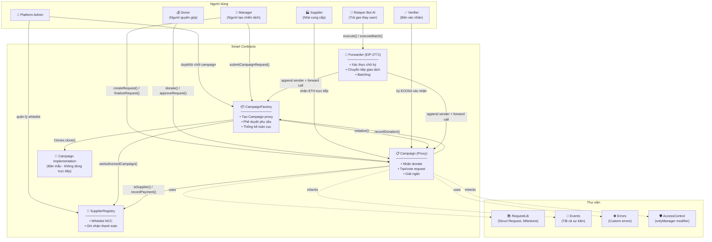

# 📊 Diagram 1: Kiến trúc tổng quan hệ thống

## Mục đích

Đây là diagram quan trọng nhất, giúp người đọc hiểu ngay lập tức cách các contract liên kết với nhau và vai trò của từng thành phần trong hệ thống. Không có cái nhìn tổng quan này, người đọc sẽ bị lạc khi đi vào chi tiết từng contract.

## Diagram

## Giải thích chi tiết

### Tổng quan các contract

| Contract | File | Vai trò |
|---|---|---|
| **CampaignFactory** | `contracts/CampaignFactory.sol` | Nhà máy tạo và quản lý tất cả chiến dịch gây quỹ |
| **Campaign** | `contracts/Campaign.sol` | Logic cốt lõi của từng chiến dịch |
| **SupplierRegistry** | `contracts/SupplierRegistry.sol` | Sổ cái toàn cục quản lý nhà cung cấp uy tín |
| **Forwarder** | `contracts/Forwarder.sol` | Điều phối Meta-Transaction (EIP-2771) |
| **RequestLib** | `contracts/RequestLib.sol` | Thư viện cấu trúc dữ liệu Request/Milestone |
| **Events** | `contracts/Events.sol` | Định nghĩa tất cả sự kiện on-chain |
| **Errors** | `contracts/Errors.sol` | Định nghĩa tất cả custom errors |
| **AccessControl** | `contracts/modifiers/AccessControl.sol` | Modifier kiểm soát quyền theo vai trò |

### Mô hình Minimal Proxy (EIP-1167)

Factory deploy 1 bản `Campaign` Implementation duy nhất trong constructor (`new Campaign()`), sau đó mỗi khi Admin duyệt chiến dịch mới, Factory clone bản mẫu này thành Proxy bằng `Clones.clone()` — tiết kiệm ~90% gas so với deploy contract mới.

- Dòng deploy Implementation: `CampaignFactory.sol:100`
- Dòng clone proxy: `CampaignFactory.sol:174`

### Phân quyền 3 tầng

| Vai trò | Quyền hạn | Contract |
|---|---|---|
| **Admin** | Duyệt campaign, quản lý NCC, rút phí, chuyển quyền admin | Factory, Registry |
| **Manager** | Tạo campaign, tạo/hủy request, finalize, deactivate | Campaign |
| **Donor** | Donate, biểu quyết (weighted + validator), claim refund | Campaign |
| **Supplier** | Nhận ETH giải ngân, cập nhật thông tin cá nhân | Registry |
| **Verifier** | Ký ECDSA xác nhận giao hàng | Campaign (off-chain) |
| **Relayer** | Gửi meta-transaction thay user, trả gas | Forwarder |

### Luồng ủy quyền quan trọng

1. **Factory → Registry**: Khi approve campaign, Factory gọi `setAuthorizedCampaign(campaign, true)` để campaign mới có quyền gọi `recordPayment()` tại Registry.
2. **Campaign → Factory**: Khi có donation, Campaign gọi `recordDonation()` để cập nhật thống kê toàn cục.
3. **Forwarder → Target**: Forwarder append 20 bytes sender gốc vào cuối calldata, target contract dùng `_msgSender()` override để extract.
