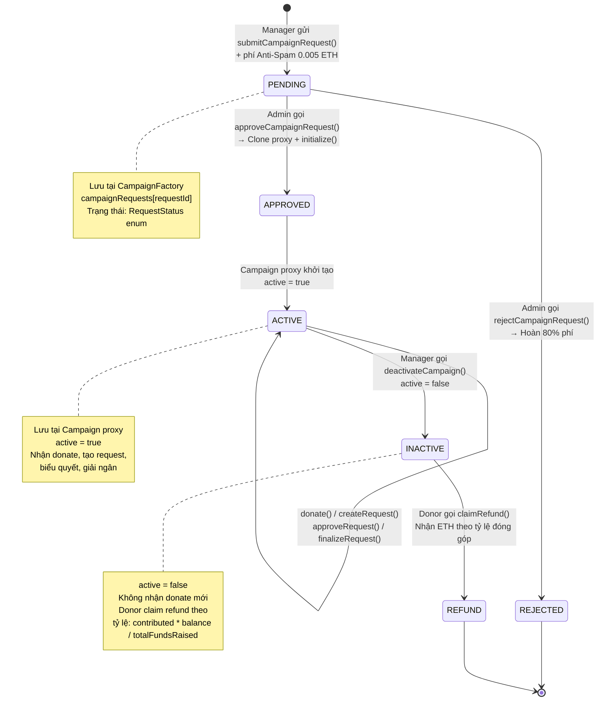

# 📊 Diagram 2: Vòng đời chiến dịch (Campaign Lifecycle)

## Mục đích

Chiến dịch có một quy trình phê duyệt 2 bước (Submit → Admin Approve → Deploy). Diagram này giúp hiểu rõ khi nào một chiến dịch thực sự tồn tại on-chain, các trạng thái nó có thể ở, và cách chuyển đổi giữa chúng.

## Diagram

## Giải thích chi tiết

### Bước 1: Submit Request (PENDING)

Manager gửi yêu cầu tạo chiến dịch qua `submitCampaignRequest()` tại CampaignFactory:

- **Tham số**: `metadataCID` (CID metadata trên IPFS), `category` (enum: Education, Medical, Disaster, Environment, Others), `minimum` (contribution tối thiểu)
- **Phí Anti-Spam**: `msg.value >= antiSpamFee` (mặc định 0.005 ETH). Phí này ngăn chặn spam tạo campaign ảo.
- **Lưu trữ**: `campaignRequests[requestId]` với `status = PENDING`
- **Index**: `requestIdsByManager[manager].push(requestId)` để tra cứu theo manager

**Source**: `CampaignFactory.sol:131-159`

### Bước 2a: Approve (APPROVED → ACTIVE)

Admin duyệt qua `approveCampaignRequest()`:

1. **Clone Proxy**: `Clones.clone(campaignImplementation)` — tạo Minimal Proxy mới
2. **Initialize**: Gọi `Campaign.initialize()` với metadata, category, minimum, manager, registry, forwarder, factory
3. **Ủy quyền**: `supplierRegistry.setAuthorizedCampaign(campaign, true)`
4. **Lưu index**:
   - `deployedCampaigns.push(campaignAddr)`
   - `campaignsByManager[manager].push(campaignAddr)`
   - `categoryToCampaigns[category].push(campaignAddr)`
   - `isChildCampaign[campaignAddr] = true`

**Source**: `CampaignFactory.sol:165-206`

### Bước 2b: Reject (REJECTED)

Admin từ chối qua `rejectCampaignRequest()`:

- **Hoàn phí**: `refundAmount = (antiSpamFee * REJECTION_REFUND_BPS) / 10000` = 80% phí
- **Giữ lại 20%**: Bù chi phí review của Admin
- **Chuyển ETH**: `manager.call{value: refundAmount}("")`

**Source**: `CampaignFactory.sol:212-228`

### Bước 3: Hoạt động (ACTIVE)

Khi `active = true`, campaign nhận các hành động:
- `donate()` — nhận quyên góp
- `createRequest()` / `createMultiStageRequest()` — tạo yêu cầu chi tiêu
- `approveRequest()` / `approveAsValidator()` — biểu quyết
- `finalizeRequest()` / `executeMilestone()` — giải ngân
- `cancelRequest()` — hủy yêu cầu

### Bước 4: Tắt chiến dịch (INACTIVE)

Manager gọi `deactivateCampaign()`:
- Đặt `active = false`
- Emit `CampaignDeactivated()`
- Tất cả hàm có modifier `onlyActive` sẽ revert

**Source**: `Campaign.sol:401-405`

### Bước 5: Hoàn tiền (REFUND)

Donor gọi `claimRefund()` khi campaign inactive:

- **Công thức**: `refundAmount = (contributed * address(this).balance) / totalFundsRaised`
- **Tỷ lệ**: Nếu campaign đã giải ngân một phần, donor nhận tỷ lệ tương ứng với phần còn lại
- **Reset**: `contributions[sender] = 0` sau khi claim
- **Bảo mật**: Dùng `nonReentrant` modifier

**Source**: `Campaign.sol:578-594`

### Bảng tham chiếu

| Hành động | Hàm | File:Dòng |
|---|---|---|
| Submit request | `submitCampaignRequest()` | `CampaignFactory.sol:131-159` |
| Approve + deploy | `approveCampaignRequest()` | `CampaignFactory.sol:165-206` |
| Reject + refund 80% | `rejectCampaignRequest()` | `CampaignFactory.sol:212-228` |
| Deactivate | `deactivateCampaign()` | `Campaign.sol:401-405` |
| Claim refund | `claimRefund()` | `Campaign.sol:578-594` |
