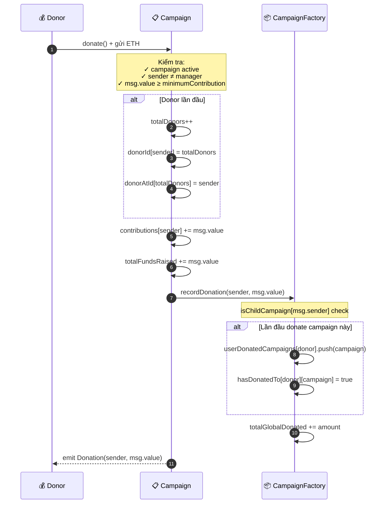

# 📊 Diagram 3: Luồng quyên góp (Donation Flow)

## Mục đích

Hiểu cơ chế tracking donor, gán voting weight, và cách Factory duy trì thống kê toàn cục.

## Diagram

## Giải thích chi tiết

### Kiểm tra đầu vào
1. **`onlyActive`**: Campaign phải đang active
2. **`sender != manager`**: Manager không được donate cho chính chiến dịch mình — tránh tự tạo voting weight
3. **`msg.value >= minimumContribution`**: Tránh spam donation nhỏ

### Hệ thống Donor ID
Mỗi donor được gán ID duy nhất tăng dần. Mapping ngược `donorAtId` cho phép truy cập donor theo index — dùng trong thuật toán chọn Validator ngẫu nhiên `_getRandomValidators()`.

### Voting Weight
Trọng số biểu quyết = tổng ETH đã đóng góp. Hệ thống dùng **delta voting** — donor donate thêm sau khi đã vote thì phần chênh lệch được cộng thêm.

### Thống kê toàn cục
Campaign callback `recordDonation()` lên Factory: tracking `userDonatedCampaigns` (cho Dashboard) và `totalGlobalDonated`.

### Tham chiếu
| Logic | File | Dòng |
|---|---|---|
| `donate()` | `Campaign.sol` | 134-151 |
| `recordDonation()` | `CampaignFactory.sol` | 323-333 |
