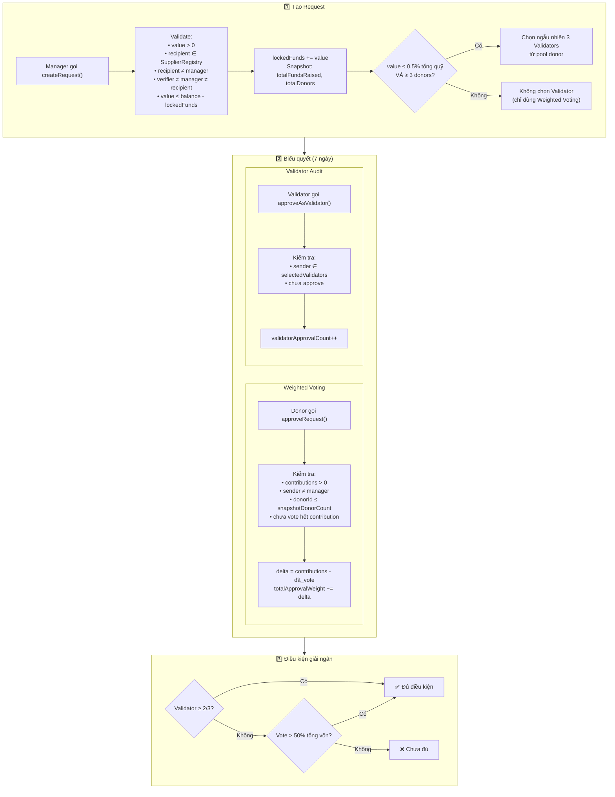

# 📊 Diagram 4: Quản trị biểu quyết (Governance & Voting)

## Mục đích

Đây là phần phức tạp nhất — hệ thống bảo mật đa tầng với 2 cơ chế biểu quyết song song: Weighted Voting và Validator Audit. Diagram giải thích rõ điều kiện để giải ngân.

## Diagram



## Giải thích chi tiết

### Hệ thống bảo mật đa tầng

| Tầng | Cơ chế | Điều kiện đạt |
|---|---|---|
| **Weighted Voting** | Donor vote theo trọng số ETH đã đóng | `totalApprovalWeight > snapshotTotalFunds / 2` |
| **Validator Audit** | 3 donor ngẫu nhiên kiểm tra | `validatorApprovalCount >= 2` |
| **Verifier Signature** | Bên thứ 3 xác nhận giao hàng | ECDSA signature hợp lệ |

### Cơ chế Snapshot

Tại thời điểm tạo request, hệ thống chụp lại `totalFundsRaised` và `totalDonors`. Chỉ donor có `donorId <= snapshotDonorCount` mới được vote — **ngăn chặn tấn công mua vote** bằng cách donate sau khi request được tạo.

### Delta Voting

Nếu donor đã vote 1 ETH, sau đó donate thêm 2 ETH, họ có thể vote thêm 2 ETH (delta = 3 - 1 = 2):
```
delta = contributions[sender] - requestVotedAmount[index][sender]
```

### Validator Selection

Dùng `prevrandao + timestamp + seed` tạo số ngẫu nhiên, chọn 3 donor. Validator phải: khác manager, khác nhau, không nằm trong danh sách failed. Sau 2 ngày không phản hồi → Manager gọi `reselectValidators()`.

### Tham chiếu
| Logic | File | Dòng |
|---|---|---|
| `createRequest()` | `Campaign.sol` | 153-203 |
| `approveRequest()` | `Campaign.sol` | 257-282 |
| `approveAsValidator()` | `Campaign.sol` | 284-308 |
| `_getRandomValidators()` | `Campaign.sol` | 503-536 |
| `reselectValidators()` | `Campaign.sol` | 466-498 |
