# 📊 Diagram 5: Quy trình giải ngân 2 giai đoạn (Two-Stage Disbursement)

## Mục đích

Cơ chế bảo mật cốt lõi theo chuẩn WFP — tiền chỉ được chuyển khi có cả biểu quyết thành công VÀ chữ ký ECDSA từ Verifier xác nhận đã giao hàng. Diagram thể hiện cả Single và Multi-Stage request.

## Diagram

```mermaid
sequenceDiagram
    autonumber
    participant M as 👤 Manager
    participant C as 📋 Campaign
    participant V as ✅ Verifier
    participant S as 🏭 Supplier
    participant SR as 📒 SupplierRegistry

    Note over M,SR: === SINGLE REQUEST ===

    rect rgb(40, 40, 70)
    Note over M,C: Giai đoạn 1: Biểu quyết đã PASS
    M->>V: Yêu cầu kiểm tra hàng hóa/dịch vụ
    V->>V: Kiểm tra thực tế + tạo báo cáo IPFS
    V->>V: Ký ECDSA: keccak256(chainid, contract, index, "FINAL")
    V-->>M: Trả về signature
    end

    rect rgb(40, 70, 40)
    Note over M,SR: Giai đoạn 2: Giải ngân
    M->>C: finalizeRequest(index, signature, finalMetadataCID)
    C->>C: Xác thực ECDSA: recover == r.verifier
    C->>C: status = COMPLETED, lockedFunds -= value
    C->>S: Transfer ETH trực tiếp
    C->>SR: recordPayment(supplier, value)
    C-->>M: emit FundsReleased(index, recipient)
    end

    Note over M,SR: === MULTI-STAGE REQUEST ===

    rect rgb(70, 40, 40)
    Note over M,SR: Giải ngân theo từng Milestone
    M->>V: Yêu cầu xác nhận milestone
    V->>V: Ký ECDSA: keccak256(chainid, contract, index, milestoneIndex)
    V-->>M: Trả về signature

    M->>C: executeMilestone(index, signature, metadataCID)
    C->>C: milestone.released = true, currentMilestone++
    
    alt Tất cả milestones hoàn thành
        C->>C: status = COMPLETED
    end

    C->>S: Transfer ETH (giá trị milestone)
    C->>SR: recordPayment(supplier, milestone.value)
    end
```



## Giải thích chi tiết

### Tại sao cần 2 giai đoạn?

Theo chuẩn WFP (World Food Programme), tiền viện trợ chỉ được giải ngân khi có bên thứ 3 độc lập (Verifier) xác nhận hàng hóa/dịch vụ đã được giao. Ngăn Manager tạo request giả rút tiền.

### ECDSA Signature

- **Single**: `keccak256(chainid, contract address, request index, "FINAL")`
- **Multi**: `keccak256(chainid, contract address, request index, milestone index)`
- Đảm bảo chữ ký không thể tái sử dụng ở chain/contract/request khác

### Điều kiện finalizeRequest (Single)

```
canFinalize = false
if (selectedValidators.length > 0 && validatorApprovalCount >= 2):
    canFinalize = true
if (totalApprovalWeight > snapshotTotalFunds / 2):
    canFinalize = true
```

### Điều kiện executeMilestone (Multi)

```
totalApprovalWeight > snapshotTotalFunds / 2  (bắt buộc > 50%)
```

### Bảo mật

- **Direct Transfer**: ETH chuyển thẳng Campaign → Supplier, không qua Manager
- **ReentrancyGuard**: `nonReentrant` modifier trên cả 2 hàm
- **Cancel Guard**: `cancelRequest()` chỉ khi `currentMilestone == 0`

### Tham chiếu
| Logic | File | Dòng |
|---|---|---|
| `finalizeRequest()` | `Campaign.sol` | 310-349 |
| `executeMilestone()` | `Campaign.sol` | 351-399 |
| `cancelRequest()` | `Campaign.sol` | 562-576 |
