# 📊 Diagram 6: Luồng Meta-Transaction Gasless (EIP-2771)

## Mục đích

Hiểu cách user giao dịch mà không cần giữ ETH trả gas. Relayer (Bot AI) trả gas thay và Forwarder chuyển tiếp giao dịch, giữ nguyên danh tính người gửi gốc.

## Diagram

```mermaid
sequenceDiagram
    autonumber
    participant U as 👤 User (không có ETH)
    participant R as 🤖 Relayer Bot AI
    participant F as 🔀 Forwarder
    participant T as 📋 Target Contract

    rect rgb(40, 40, 70)
    Note over U,R: Bước 1: Ký off-chain (EIP-712)
    U->>U: Tạo ForwardRequest:<br/>{from, to, value, gas, nonce, data}
    U->>U: Ký EIP-712 typed data → signature
    U->>R: Gửi ForwardRequest + signature
    end

    rect rgb(40, 70, 40)
    Note over R,T: Bước 2: Relayer thực thi on-chain
    R->>F: execute(req, signature) + trả gas
    F->>F: verify(): recover signer == req.from<br/>+ nonce khớp _nonces[from]
    F->>F: _nonces[from]++
    F->>T: call{gas}(data + req.from)
    
    Note over T: _msgSender() override:<br/>if isTrustedForwarder:<br/>  sender = last 20 bytes<br/>else: sender = msg.sender

    T-->>F: Kết quả
    F-->>R: return (success, returndata)
    end

    Note over U,T: === BATCHING ===

    rect rgb(70, 40, 40)
    U->>R: Request 1 + sig1
    U->>R: Request 2 + sig2
    R->>F: executeBatch([req1,req2], [sig1,sig2])
    Note over F: 2 requests trong 1 tx<br/>Tiết kiệm gas base 21000
    end
```



## Giải thích chi tiết

### Cấu trúc ForwardRequest

```solidity
struct ForwardRequest {
    address from;    // Địa chỉ người gửi gốc
    address to;      // Contract đích (Campaign/Factory)
    uint256 value;   // ETH gửi kèm (thường = 0)
    uint256 gas;     // Gas limit cho subcall
    uint256 nonce;   // Chống replay attack
    bytes data;      // Calldata gốc (VD: donate(), approveRequest())
}
```

### EIP-712 Typed Data

Forwarder dùng domain separator `("FundraisingForwarder", "1")` để tạo structured hash. Người dùng biết chính xác họ đang ký gì — tránh bị lừa ký giao dịch ác ý.

### _msgSender() Override

Khi Forwarder gọi target contract, nó append 20 bytes sender gốc vào cuối calldata:
```solidity
req.to.call{gas}(abi.encodePacked(req.data, req.from))
```

Target contract dùng assembly để extract sender:
```solidity
if (isTrustedForwarder(msg.sender) && msg.data.length >= 20) {
    assembly { sender := shr(96, calldataload(sub(calldatasize(), 20))) }
}
```

### Gas Tank

Mỗi Campaign có `gasBalance` riêng:
- **Manager nạp**: `depositGas()` → `gasBalance += msg.value`
- **Factory rút**: `withdrawGasFunds()` → chuyển gas cho Relayer Bot
- Relayer dùng ETH này để trả gas cho meta-transactions

### Nonce Protection

Mỗi address có nonce riêng: `_nonces[from]++` sau mỗi execute. Ngăn chặn replay attack.

### Batching

`executeBatch()` gom nhiều ForwardRequest vào 1 transaction — tiết kiệm 21000 gas base cho mỗi tx được gom.

### Tham chiếu
| Logic | File | Dòng |
|---|---|---|
| ForwardRequest struct | `Forwarder.sol` | 17-24 |
| verify() | `Forwarder.sol` | 37-41 |
| execute() | `Forwarder.sol` | 44-60 |
| executeBatch() | `Forwarder.sol` | 65-70 |
| _msgSender() override | `Campaign.sol` | 113-121 |
| Gas Tank | `Campaign.sol` | 86-99 |
