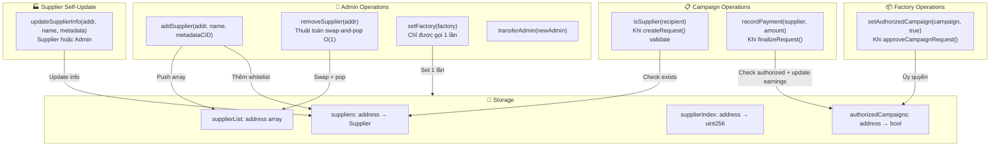

# 📊 Diagram 7: Quản lý Nhà cung cấp (Supplier Registry)

## Mục đích

SupplierRegistry là lớp bảo mật chống rút tiền trái phép — tiền chỉ có thể gửi đến nhà cung cấp đã được Admin xác minh. Diagram giúp hiểu quy trình CRUD, ủy quyền, và các quyền hạn.

## Diagram



## Giải thích chi tiết

### Supplier Struct

```solidity
struct Supplier {
    uint256 totalEarned;   // Tổng thu nhập từ các campaign
    string name;           // Tên NCC
    string metadataCID;    // CID metadata trên IPFS
    bool exists;           // Đã whitelist hay chưa
}
```

### Push Authorization Model

Khi Factory approve campaign mới → gọi `setAuthorizedCampaign(campaign, true)`. Campaign sau đó gọi `recordPayment()` mà không cần callback lại Factory — tiết kiệm gas.

### Swap-and-Pop O(1) Delete

Khi xóa supplier tại vị trí `i`:
1. Swap `supplierList[i]` với phần tử cuối
2. Update `supplierIndex` của phần tử cuối = `i`
3. `supplierList.pop()`
4. Delete `supplierIndex[supplier]` và `suppliers[supplier]`

### Dual Access Control

`updateSupplierInfo()` cho phép cả Admin VÀ Supplier tự cập nhật:
```solidity
if (_msgSender() != admin && _msgSender() != _supplier) revert NotAdmin();
```

### Tham chiếu
| Logic | File | Dòng |
|---|---|---|
| `addSupplier()` | `SupplierRegistry.sol` | 100-118 |
| `removeSupplier()` | `SupplierRegistry.sol` | 140-157 |
| `recordPayment()` | `SupplierRegistry.sol` | 162-175 |
| `setAuthorizedCampaign()` | `SupplierRegistry.sol` | 78-84 |
| `updateSupplierInfo()` | `SupplierRegistry.sol` | 123-135 |
