# Báo cáo LaTeX

Biên dịch từ thư mục `pm/`:

```bash
latexmk -xelatex main.tex
```

`latexmk` sẽ tự chạy XeLaTeX và BibTeX đủ số lần để cập nhật mục lục, dẫn chiếu và tài liệu tham khảo.

Cấu trúc:

- `main.tex`: điểm vào của báo cáo.
- `config/preamble.tex`: font, lề, heading và package dùng chung.
- `frontmatter/`: bìa, cảm ơn, từ viết tắt.
- `chapters/introduction.tex`: phần Mở đầu hoàn chỉnh.
- `chapters/chapter01.tex` đến `chapter12.tex`: các chương nội dung.
- `backmatter/`: kết luận và phụ lục.
- `references.bib`: tài liệu tham khảo BibTeX.
- `assets/`: hình ảnh dành riêng cho báo cáo.

Các tệp sinh khi biên dịch được loại khỏi Git bằng `.gitignore` trong thư mục này.

## Ghi chú cập nhật Chương 1, 2, 3, 4, 7

`Lời cam đoan` đã được bỏ khỏi luồng biên dịch của báo cáo.

### Hình cần bổ sung

Các hình dưới đây đang là placeholder trong LaTeX. Bạn có thể dựng trước bằng Mermaid rồi export ra PDF/PNG để đưa vào `pm/assets/`.

#### Chương 1

`ch01-business-flow.pdf` - Quy trình nghiệp vụ tổng quát của FundChain

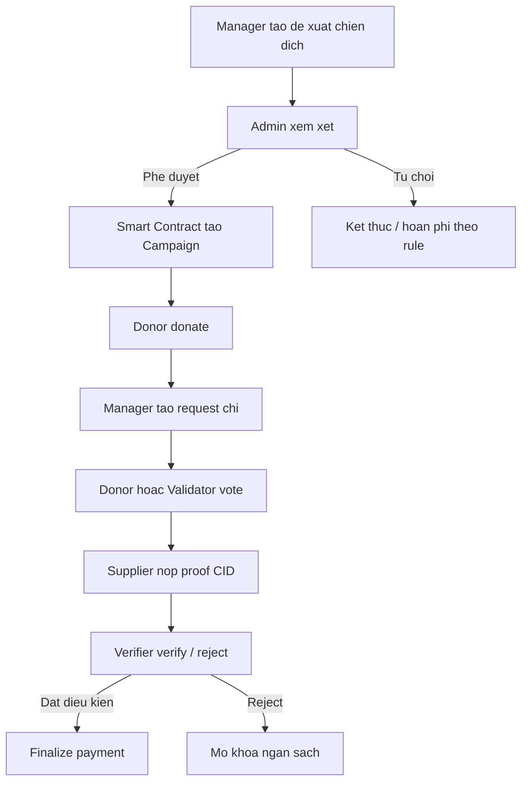

`ch01-system-architecture.pdf` - Kiến trúc sản phẩm phục vụ phân tích phạm vi và phụ thuộc

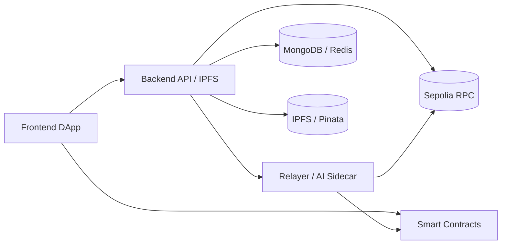

`ch01-stakeholder-map.pdf` - Bản đồ quyền lực và mức quan tâm của stakeholder

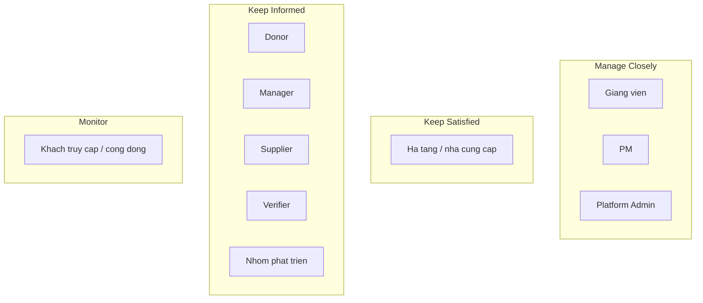

#### Chương 2

`ch02-scope-management-process.pdf` - Quy trình quản lý phạm vi của dự án

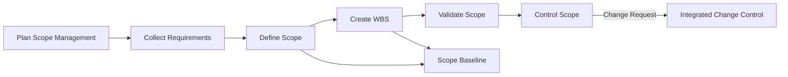

`ch02-wbs-tree.pdf` - Cấu trúc phân rã công việc của dự án FundChain

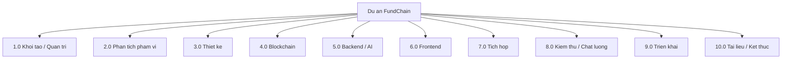

`ch02-scope-validation-flow.pdf` - Quy trình xác nhận phạm vi và deliverable

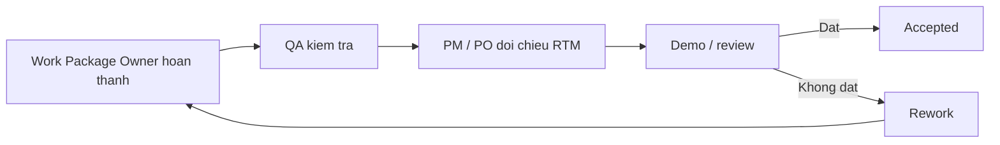

`ch02-change-control-flow.pdf` - Quy trình kiểm soát thay đổi phạm vi

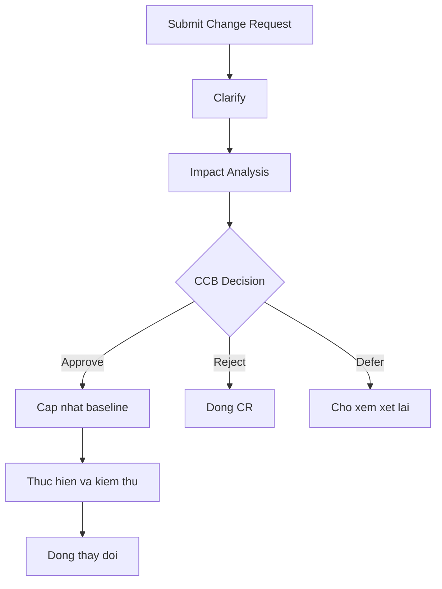

#### Chương 3

`ch03-alternative-comparison.png` - So sánh tổng quan ba phương án đầu tư

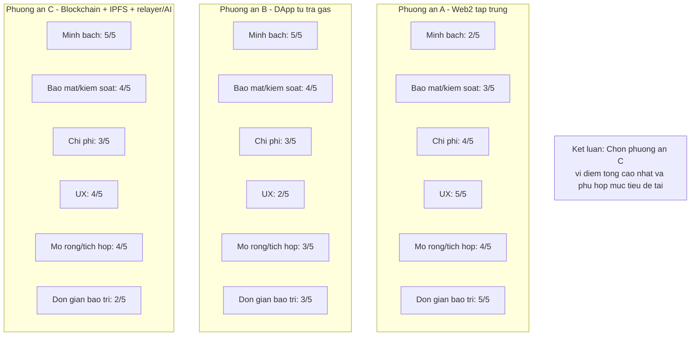

#### Chương 4

`ch04-schedule-management-process.png` - Quy trình quản lý thời gian của dự án

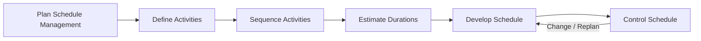

`ch04-network-diagram.png` - Sơ đồ mạng và đường găng dự kiến của dự án

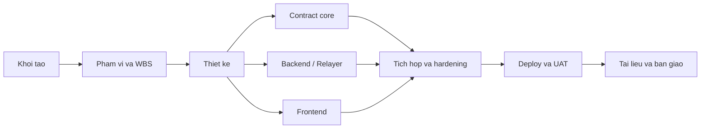

`ch04-gantt-overview.png` - Biểu đồ Gantt tổng quan của dự án

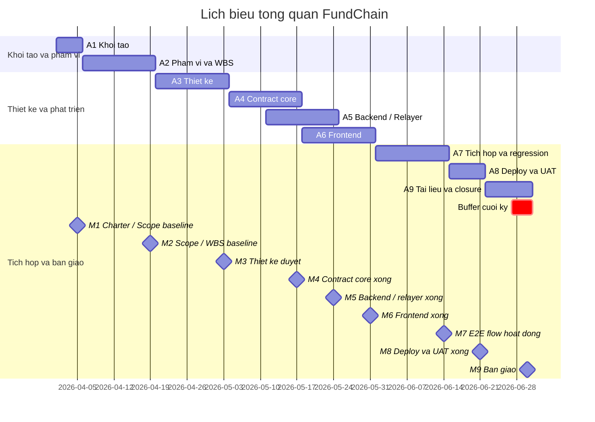

#### Chương 5

`ch05-cost-estimation-approach.png` - Phương pháp lập và tổng hợp ước lượng chi phí

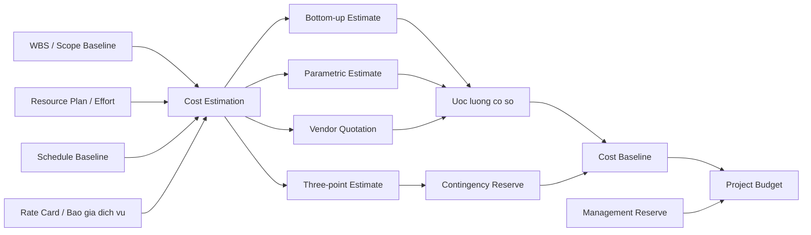

`ch05-cost-baseline-scurve.png` - Đường cong phân bổ Cost Baseline của dự án

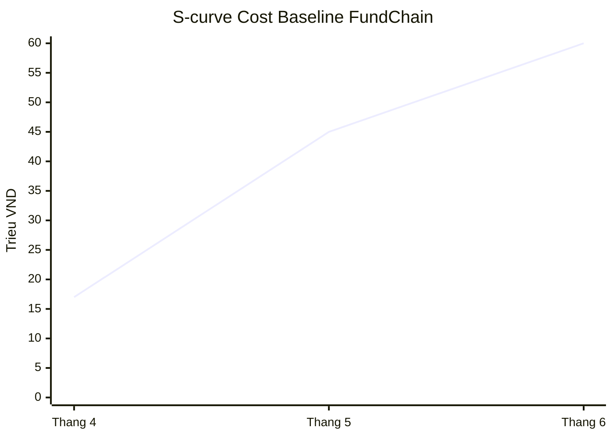

#### Chương 6

`ch06-quality-foundation.png` - Cơ sở xác định chất lượng của dự án

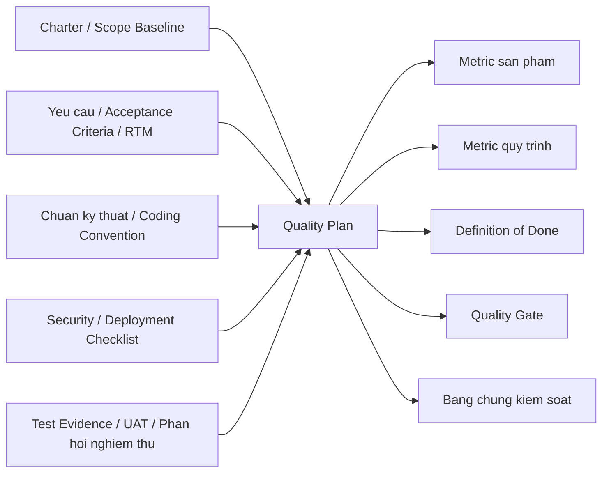

`ch06-quality-management-process.png` - Quy trình quản lý chất lượng của dự án

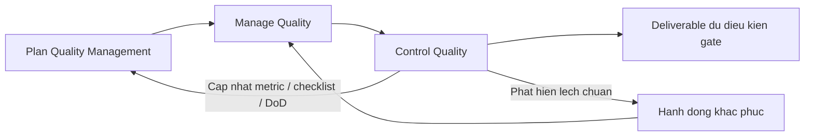

`ch06-defect-lifecycle.png` - Vòng đời xử lý lỗi của dự án

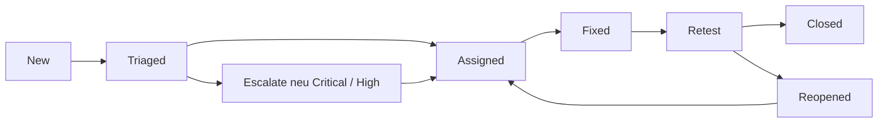

#### Chương 7

`ch07-resource-management-process.pdf` - Quy trình quản lý nguồn nhân lực của dự án

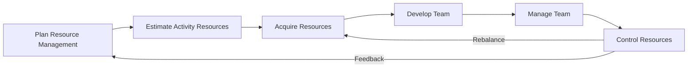

`ch07-project-organization-chart.pdf` - Cơ cấu tổ chức dự án FundChain

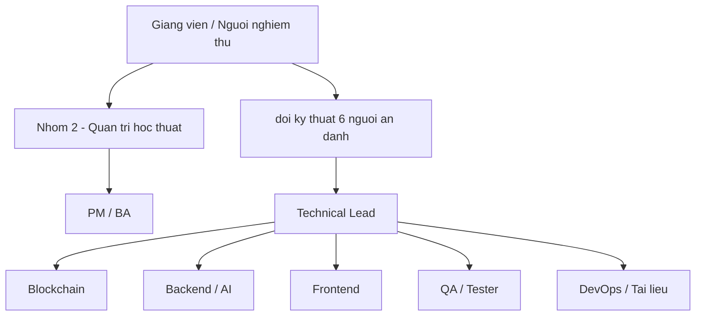

`ch07-resource-histogram.pdf` - Biểu đồ nhu cầu và khả năng nguồn lực theo thời gian

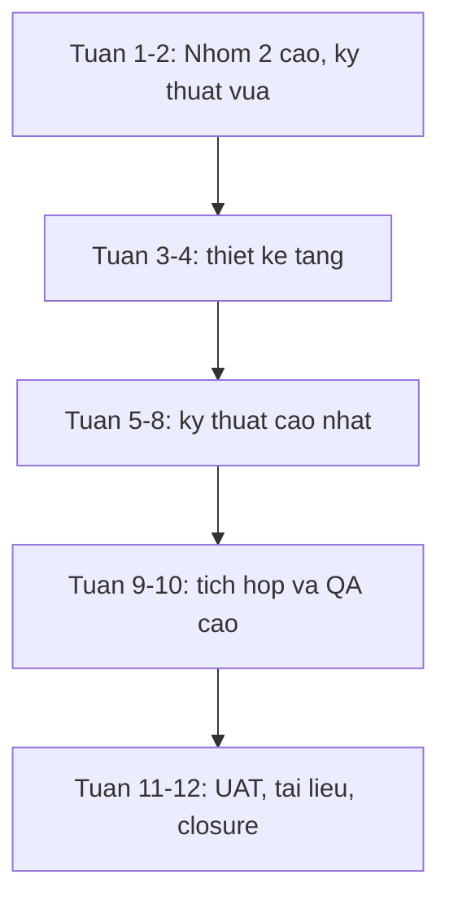

`ch07-conflict-resolution-flow.pdf` - Quy trình xử lý và escalation xung đột

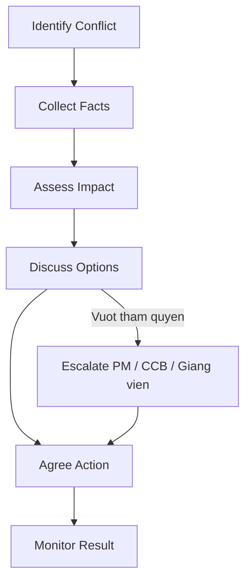

#### Chương 8

`ch08-communication-management-process.png` - Quy trình quản lý truyền thông của dự án

```mermaid
flowchart LR
    A[Plan Communications] --> B[Manage Communications]
    B --> C[Monitor Communications]
    C -->|Dieu chinh stakeholder / kenh / tan suat| A
```

#### Chương 9

`ch09-risk-management-process.png` - Quy trình quản lý rủi ro của dự án

```mermaid
flowchart LR
    A[Plan Risk Management] --> B[Identify Risks]
    B --> C[Qualitative Analysis]
    C --> D[Quantitative Analysis]
    D --> E[Plan Risk Responses]
    E --> F[Implement Risk Responses]
    F --> G[Monitor Risks]
    G -->|Cap nhat Risk Register / Reserve| B
```

`ch09-probability-impact-matrix.png` - Ma trận xác suất -- tác động của rủi ro

```mermaid
quadrantChart
    title Probability - Impact Matrix
    x-axis Thap --> Cao
    y-axis Thap --> Cao
    quadrant-1 Critical
    quadrant-2 High
    quadrant-3 Low
    quadrant-4 Medium
    R01 Scope creep: [0.82, 0.82]
    R03 Contract vulnerability: [0.72, 0.92]
    R05 ABI / config mismatch: [0.84, 0.78]
    R09 Defect leakage: [0.80, 0.80]
```

#### Chương 10

`ch10-procurement-flow.png` - Quy trình quản lý mua sắm của dự án

```mermaid
flowchart LR
    A[Xac dinh nhu cau] --> B[Make or Buy Analysis]
    B --> C[Shortlist nha cung cap]
    C --> D[Danh gia ky thuat / thuong mai]
    D --> E[PoC neu can]
    E --> F[Phe duyet]
    F --> G[Trien khai su dung]
    G --> H[Theo doi SLA / usage / chi phi]
    H -->|Khong dat yeu cau| I[Vendor Change Request]
    I --> C
```

#### Chương 11

`ch11-integration-management-process.png` - Quy trình quản lý tích hợp của dự án

```mermaid
flowchart LR
    A[Develop Project Charter] --> B[Develop Project Management Plan]
    B --> C[Direct and Manage Project Work]
    C --> D[Manage Project Knowledge]
    D --> E[Monitor and Control Project Work]
    E --> F[Perform Integrated Change Control]
    F --> G[Close Project or Phase]
    E -->|Feedback| B
```

`ch11-system-integration-sequence.png` - Luồng tích hợp tổng thể của hệ thống FundChain

```mermaid
sequenceDiagram
    participant U as User / Frontend
    participant W as Wallet
    participant B as Backend / Relayer
    participant I as IPFS
    participant C as Smart Contract
    participant L as Listener / Notification

    alt Direct transaction
        U->>W: Tao va ky transaction
        W->>C: Gui transaction len chain
        C-->>L: Phat event
        L-->>U: Cap nhat trang thai / thong bao
    else Gasless transaction
        U->>B: Gui signed intent
        B->>I: Luu metadata / proof neu can
        B->>C: Relay transaction
        C-->>L: Phat event
        L-->>U: Cap nhat trang thai cuoi
    end
```

#### Chương 12

`ch12-project-closure-flow.png` - Quy trình kết thúc dự án FundChain

```mermaid
flowchart LR
    A[Final verification] --> B[Acceptance]
    B --> C[Handover]
    C --> D[Archive documents]
    D --> E[Lessons learned]
    E --> F[Revoke access]
    F --> G[Close project]
    B -->|Chua dat dieu kien| H[Rework / Hoan thien]
    H --> A
```

### Bảng đã có trong LaTeX

Các bảng dưới đây đã được viết sẵn trong nội dung. Bạn không cần import file riêng, chỉ cần rà nội dung nếu muốn chỉnh tiếp.

#### Chương 1

- `tab:project-overview` - Thông tin khái quát về dự án
- `tab:success-metrics` - Mục tiêu và chỉ số thành công của dự án
- `tab:product-components` - Các hợp phần sản phẩm và vấn đề quản trị tương ứng
- `tab:user-roles` - Nhu cầu và quyền hạn của người dùng trực tiếp
- `tab:stakeholder-grid` - Phân loại stakeholder theo quyền lực và mức quan tâm
- `tab:deliverables` - Danh sách sản phẩm bàn giao cấp cao

#### Chương 2

- `tab:scope-responsibility` - Trách nhiệm trong quản lý phạm vi
- `tab:requirement-sources` - Nguồn yêu cầu của dự án
- `tab:management-requirements` - Yêu cầu quản trị dự án
- `tab:functional-requirements` - Yêu cầu chức năng cấp cao
- `tab:nfr` - Yêu cầu phi chức năng
- `tab:rtm-sample` - Trích Ma trận truy vết yêu cầu
- `tab:scope-deliverables` - Deliverable và tiêu chí chấp nhận cấp cao
- `tab:wbs-detail` - Cấu trúc WBS chi tiết
- `tab:wbs-dictionary` - Trích WBS Dictionary cho work package 2.4
- `tab:wbs-dictionary-e2e` - Trích WBS Dictionary cho work package 7.5
- `tab:acceptance-evidence` - Bằng chứng xác nhận theo loại deliverable
- `tab:change-level` - Phân loại thay đổi phạm vi

#### Chương 3

- `tab:investment-criteria` - Tiêu chí đánh giá phương án đầu tư
- `tab:alternative-scoring` - So sánh và chấm điểm các phương án đầu tư

#### Chương 4

- `tab:schedule-activities` - Danh mục hoạt động cấp giai đoạn của dự án
- `tab:three-point-estimation` - Ví dụ ước lượng ba điểm cho các hoạt động rủi ro cao
- `tab:activity-resources` - Nguồn lực chủ đạo theo hoạt động cấp giai đoạn
- `tab:project-milestones` - Milestone chính của dự án
- `tab:schedule-baseline` - Schedule Baseline cấp cao của dự án
- `tab:schedule-thresholds` - Ngưỡng kiểm soát lịch biểu

#### Chương 5

- `tab:labor-cost-estimate` - Ước lượng chi phí nhân sự quy đổi
- `tab:infra-cost-estimate` - Ước lượng chi phí hạ tầng và dịch vụ
- `tab:blockchain-cost-estimate` - Ước lượng chi phí blockchain và vận hành thử nghiệm
- `tab:support-cost-estimate` - Ước lượng chi phí hỗ trợ chất lượng và bàn giao
- `tab:project-budget` - Ngân sách tổng hợp của dự án
- `tab:cost-baseline-phasing` - Phân bổ Cost Baseline theo thời gian
- `tab:cost-thresholds` - Ngưỡng kiểm soát chi phí

#### Chương 6

- `tab:product-quality-metrics` - Metric chất lượng sản phẩm
- `tab:process-quality-metrics` - Metric chất lượng quy trình
- `tab:quality-gates` - Quality gate theo giai đoạn
- `tab:defect-severity` - Mức độ lỗi và SLA nội bộ

#### Chương 7

- `tab:student-team` - Danh sách sinh viên thực hiện tiểu luận
- `tab:role-description` - Mô tả vai trò trong dự án
- `tab:raci` - Ma trận RACI của dự án
- `tab:competency-target` - Mức năng lực mục tiêu theo vai trò
- `tab:effort-allocation` - Phân bổ effort nguồn nhân lực theo WBS cấp cao
- `tab:resource-calendar` - Resource calendar cấp nhóm
- `tab:training-plan` - Kế hoạch phát triển năng lực nhóm
- `tab:performance-criteria` - Tiêu chí theo dõi hiệu suất nguồn nhân lực
- `tab:conflict-strategy` - Chiến lược xử lý xung đột

#### Chương 8

- `tab:communication-matrix` - Ma trận truyền thông của dự án
- `tab:status-report-content` - Nội dung chuẩn của báo cáo trạng thái
- `tab:communication-thresholds` - Ngưỡng theo dõi hiệu quả truyền thông

#### Chương 9

- `tab:rbs` - Risk Breakdown Structure của dự án
- `tab:risk-register` - Risk Register trọng yếu của dự án
- `tab:emv-sample` - Ví dụ phân tích EMV cho một số rủi ro chi phí
- `tab:risk-response-plan` - Kế hoạch phản hồi cho các rủi ro ưu tiên cao
- `tab:risk-thresholds` - Ngưỡng giám sát rủi ro

#### Chương 10

- `tab:make-or-buy` - Phân tích make-or-buy của dự án
- `tab:vendor-selection-criteria` - Tiêu chí lựa chọn nhà cung cấp
- `tab:procurement-items` - Danh sách hạng mục mua sắm của dự án
- `tab:procurement-risks` - Rủi ro mua sắm chính của dự án

#### Chương 11

- `tab:change-impact-dimensions` - Các chiều tác động trong Integrated Change Control
- `tab:configuration-items` - Các đối tượng cấu hình trọng yếu của dự án
- `tab:npv-sensitivity` - Phân tích sensitivity đơn giản cho NPV

#### Chương 12

- `tab:handover-items` - Danh mục bàn giao cuối dự án
- `tab:closure-evaluation` - Khung đánh giá hiệu quả dự án khi kết thúc
- `tab:closure-checklist` - Closure checklist cấp cao của dự án
